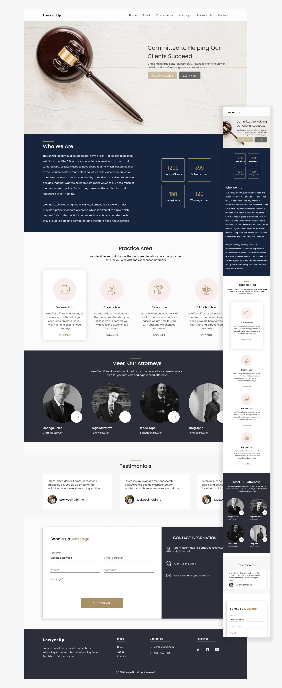

# Lawyer-up landing page

This is a landing page for a hypothetical Law firm.

## Table of contents

- [Overview](#overview)
  - [The challenge](#the-challenge)
  - [Screenshot](#screenshot)
  - [Links](#links)
- [My process](#my-process)
  - [Built with](#built-with)
- [Author](#author)

## Overview

### The challenge

Users should be able to:

- View the optimal layout for the site depending on their device's screen size
- See hover states for all interactive elements on the page

### Screenshot

### Links

- Solution URL: [https://github.com/GoodnessObi/lawyer-up](https://github.com/GoodnessObi/lawyer-up)
- Live Site URL: [https://lawyer-up.netlify.app/](https://lawyer-up.netlify.app/)

## My process

### Built with

- Semantic HTML5 markup
- [Typescript](https://www.typescriptlang.org/docs/)
- [Vuejs](https://vuejs.org/) - JS library
- [Tailwind](https://tailwindui.com/) - For styles

## Author
- LinkedIn - [Goodness Obi](https://www.linkedin.com/in/goodnessobi/)
